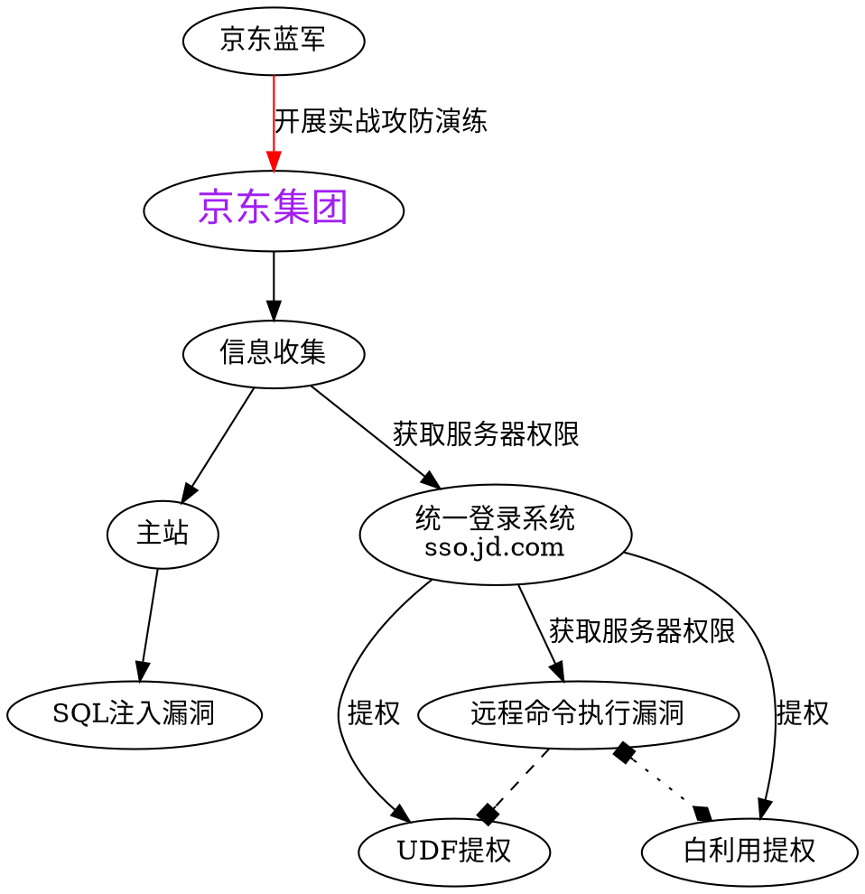

# RouteMap
a component of red teaming for generate route map.

<http://jd.army/RouteMap/>

Use dot language:

```dot
digraph LR {
    // 我们使用图标名来控制图表方向，可选值有：LR、RL、UD、DU

    // 可以设置全局的node和edge属性
    // node [shape=circle fontcolor=blue, fontsize=16]
    // edge [
    //   length=200,
    //   color=lightgray,
    //   fontcolor=lightgray,
    //   penwidth=3
    // ]

    hacker[label = "京东蓝军" icon = Threat_Actor]
    target[
        label = "京东集团",
        icon = Identity
        fontsize = 20,
        fontcolor = purple
    ]
    hacker -> target[color = red fontcolor = "#666" label = "开展实战攻防演练"]
    // hacker -- target

    "主站"[icon = Identity]
    collinfo[label = "信息收集" icon = Intrusion_Set]
    SQLin[label = "SQL注入漏洞" icon = "Vulnerability"]
    target -> collinfo -> "主站" -> SQLin

    RCE[label = "远程命令执行漏洞" icon = "Vulnerability"]
    "sso.jd"[label = "统一登录系统\nsso.jd.com" icon = Identity]
    collinfo -> "sso.jd" -> RCE[label = "获取服务器权限"]

    "UDF提权"[icon = Attack_Pattern]
    "白利用提权"[icon = Attack_Pattern]
    "sso.jd" -> {
        "UDF提权"; "白利用提权"
    }[label = "提权"]

    RCE -> "UDF提权"[style = "dashed" arrowhead = box]
    RCE -> "白利用提权"[style = "dotted" penwidth = 1 dir = both arrowhead = diamond arrowtail = box]


    // 本系统使用vis-network做图形绘制，使用dot language作为绘制语言，
    // 详见：https://visjs.github.io/vis-network/examples/network/data/dotLanguage/dotEdgeStyles.html

    // 本系统使用STIX2.1的对象和图标描述攻击路线，
    // 详见：https://oasis-open.github.io/cti-documentation/stix/intro

    // 漏洞（黑客可以直接使用软件中的错误来访问系统或网络。）
    // Vulnerability[icon="Vulnerability"]

    // 工具（可被威胁行为者用来执行攻击的合法软件。）
    // Tool[icon=Tool]

    // 威胁行为者（被认为具有恶意行为的实际个人、团体或组织。）
    // Threat_Actor[icon=Threat_Actor]

    // 瞄准（表示相信看到了 CTI 中的某些内容（例如，指标、恶意软件、工具、威胁行为者等）。）
    // Sighting[icon=Sighting]

    // 报告（集中于一个或多个主题的威胁情报集合，例如威胁参与者、恶意软件或攻击技术的描述）
    // Report[icon=Report]

    // 关系（用于将两个 SDO 或 SCO 链接在一起，以描述它们如何相互关联。）
    // Relationship[icon=Relationship]

    // 观点（对不同实体生成的 STIX 对象中信息正确性的评估。）
    // Opinion[icon=Opinion]

    // 观测数据（有关网络安全相关实体（例如文件、系统和网络）的信息）
    // Observed_Data[icon=Observed_Data]

    // 笔记（传达信息文本）
    // Note[icon=Note]

    // 恶意软件
    // Malware[icon=Malware]

    // 恶意软件分析（分析的元数据和结果）
    // Malware_Analysis[icon=Malware_Analysis]

    // 地点（代表一个地理位置）
    // Location[icon=Location]

    // 入侵集（一组具有共同属性的对抗性行为和资源）
    // Intrusion_Set[icon=Intrusion_Set]

    // 基础设施（用于攻防目的的任何系统、软件服务和任何相关的物理或虚拟资源）
    // Infrastructure[icon=Infrastructure]

    // 指标器（IOC）
    // Indicator[icon=Indicator]

    // 事件（在STIX 2.1版本中被移除了）
    // Incident[icon=Incident]

    // 身份（实际的个人、组织、系统或团体）
    // Identity[icon=Identity]

    // 分组
    // Grouping[icon=Grouping]

    // 行动方案（缓解方案）
    // Course_of_Action[icon=Course_of_Action]

    // 活动（一组对抗性行为，描述了在一段时间内针对一组特定目标发生的一组恶意活动或攻击）
    // Campaign[icon=Campaign]

    // 攻击类型（TTP）
    // Attack_Pattern[icon=Attack_Pattern]
}
```